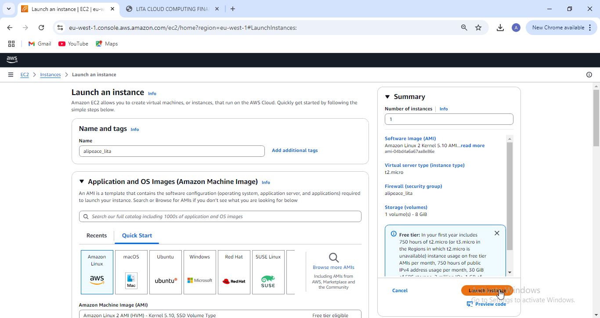
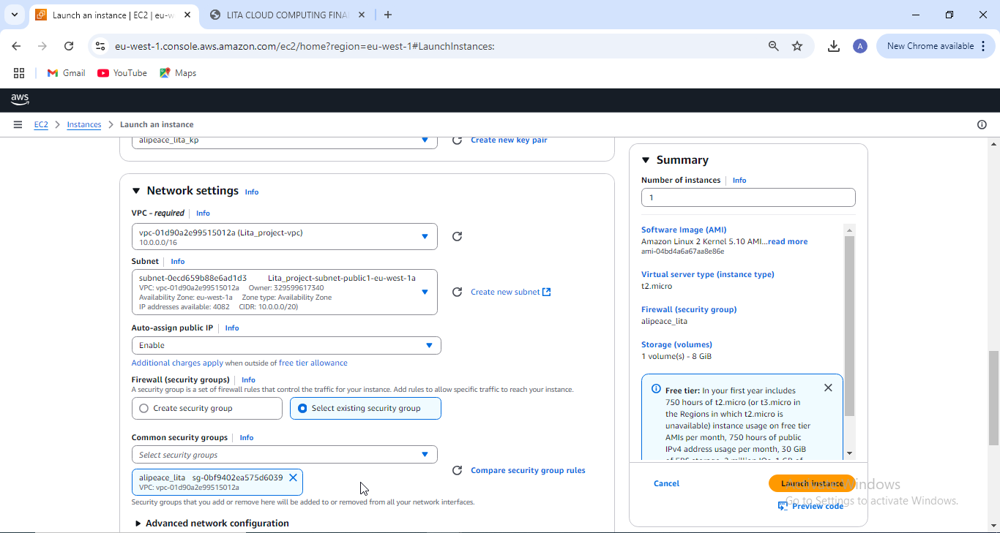
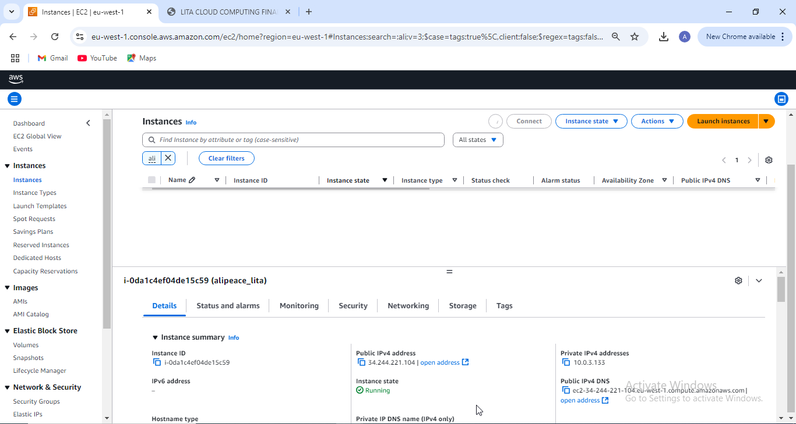
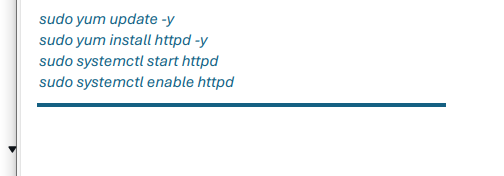

# AliPeace-AWS-Web-Application
 Learning how to deploy a web application with AWS
### Table of contents

   [AliPeace-AWS-Web-Application](#alipeace-aws-web-application)  
      [Table of Contents](#table-of-contents)  
         [Overview](#overview)
 1. [Steps on how to launch an EC2 instance](#1-steps-on-how-to-launch-an-ec2-instance)  
    1.1 [Creation of Security Group](#11-creation-of-security-group)  
    1.2 [Creation of Key Pair](#12-creation-of-key-pair)  
    1.3 [Launching of an EC2 Instance](#13-launching-of-an-ec2-instance)  
    1.4 [Installation of the Apache App](#14-installation-of-the-apache-app)  
    1.5 [Verifying the Public IP Address to check if it is working](#15-verifying-the-public-ip-address-to-check-if-it-is-working)
 2. [List of all the AWS Services used and thier purpose](#2-list-of-all-the-aws-services-used-and-thier-purpose)
## Overview

This repository is a presentation of my project on how to launch 
an Ec2 instance, the steps i followed in launching the instance and 
the purpose of each AWS services used.

## 1) Steps on how to launch an EC2 instance

### 1.1 Creation of Security group

Before the Creation of the Security group, i first changed the region
to ireland as specified in the instruction. (Note that before the Creation
of the Security group, you need to create the following; 1) Vpc, 2) subnets
3) An internet Gateway and 4) Network Access Control list. But due to the fact that the limit of vpc creation was met, i couldn't create a vpc therefore allowing 
me to use the default one created by our tutor.)

steps;
1) I searched for EC2 instance and clicked on it, and after that i searched for the network and security setting 
and clicked on security group.
2)  I then named my security group (alipeace_lita), i added a description to allow SSH and HTTP traffic.
3) I added the VPC created by our tutor.
4) Then under the inbound rule setting, i allowed the SSH(IPv4) and HTTP(IPv4).
5) I then checked if my data was correct and created the security group.

### 1.2 Creation of KeyPair
steps;
1) Still under the EC2 instance network and security  setting,click on keyPair
2) click on create Key pair
3) Name your key pair, select the key pair type(RSA), and leave the privaTe key file format as (.ppk)
4) click on create Key pair
5) you'll be prompted to download the keypair, so download it in a directory you remember.

Note : You can only download this key pair once.

### 1.3 Launching of an EC2 instance
steps;
1) Still under the EC2 instance, click on instances and then click on launch instances
2) Name your instance
3) Select the OS and the instance type you want(amazon Linux 2 as the OS and t2.micro)

4) Configure the instance type with a public subnet and assign it with the security group that was created.
5) After that you then assign the EC2 with the key pair that was created.
6) Then go to the network settings and click on the edit button.
7) Click on the VPC and select the public subnet that was created by our tutor, then enable the auto assign public ip and select the security group that was earlier created

8) Review your configuration summary and click Launch instance
9) Verify the instance is running by checking the instance state.

### 1.4 Installation of the Apache app
steps;
1) Click on Your EC2 instance and click connect
2) Copy the command on the third line to check if your key Pair is private
3) Open your GitBash in the directory you downloaded your Key Pair and Paste the command and press enter. (There will be no output)

4) copy the example.
5) Paste the copied code in your GitBash and press enter, wait for a bird signature and enter yes, then press enter.

6) Run the first command and press enter, then the second command and press enter, then run the two last command together. The Apache should have installed successfully.

### 1.5 Verifying the Public IP Address tocheck if it is working
steps;
1) Go to your EC2 Dashboard and click on instances, the click on your own instance.
2) Copy the Public Ip address and paste in your browser (Prefably chrome).

(Note: This is my public Ip Address "54.73.53.55" )

## 2) List of all the AWS Services used and thier purpose
The table below displays the list of Services i used and the purpose.
| S/N | List of AWS services Used  | Purpose |
|----|----|-----|  
| 1 | VPC | It provides an isolated section of AWS cloud where you can run and manage your resources, like  instances, servers and databases. |
| 2 | Subnets | It is used to partition a larger network into smaller manageable segments. |
| 3 |  Internet Gateway | It is to enable resources in a public subnet to communicate with the internet |
| 4 | Network Access Control List (NACL) | It act as a statless firewall at the subnet level, controlling inbound and outbound traffic for the subnet. |   
| 5 | Security Groups | It acts as a Virtual firewall for our instance. |
| 6 | EC2 Instance | It allowed us to host a web application in the cloud |
| 7 | Key Pair | It is used to securely access our instance |
| 8 | instance type | The instance type we used is called a General Purpose Instance Type(t2). It is used to provide a flexible and balanced computing environment. 
|9| The OS (Operating System) | It is the core software of a computer that provides basic services for other applications. |

